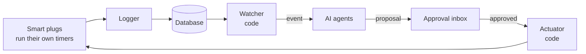

# AgentC Edge

[](https://github.com/PaSathees/agentc-edge/actions/workflows/ci.yml)

Helps a small site meet a monthly carbon goal, starting with a home. The site's carbon comes from the electricity it uses, so plain code watches every smart plug all the time. When something looks off, an AI agent takes a look with what it knows about the home's devices and habits, and asks the owner a short question while it is happening. A person approves every change before it reaches a device.

> Status: in development. Design version 2 is being built; the commands below are from version 1. Built in the open, step by step (`docs/`). Words and codes are explained in the [glossary](docs/glossary.md).

## How it works


```mermaid
flowchart LR
  P["Smart plugs<br/>run their own timers"] --> L["Logger"] --> DB[("Database")]
  DB --> W["Watcher<br/>code"]
  W -- "event" --> A["AI agents"]
  A -- "proposal" --> I["Approval inbox"]
  I -- "approved" --> X["Actuator<br/>code"] --> P
```

- **AI only when needed:** plain code checks the readings every few minutes. The AI runs only when it finds something, so a quiet day costs nothing.
- **A person decides:** every change is a proposal. Nothing reaches a plug without approval. It starts in shadow mode: it suggests, but writes nothing.
- **Code does the maths:** kWh, cost and carbon are worked out in code. The AI explains and suggests.
- **Runs at the site:** one old laptop. Only the AI calls leave it.

## Commands

| Command | Does |
|---|---|
| `agentc timers` | Reads every plug and shows its timers in plain words. Also reads what each plug does on its own (auto-off, rules) for the house model. Problems come last |
| `agentc profile Plug-6` | Shows a plug's usual week, hour by hour, and the kWh it used |
| `agentc watch` | Runs the checks that are due now and shows new signals. With an API key, the housemate looks at each one and decides: ignore, note, ask or propose |
| `agentc questions` | The housemate's open questions, numbered, with when each one reaches you (07:00 for a small load at night) |
| `agentc answer 3 2` | Answers question 3 with choice 2, as a tap would. "That's normal" saves a habit; a switch off is only recorded (shadow mode) |
| `agentc look 12 --at "2026-11-02 02:10"` | Runs the housemate on one saved signal and shows the tools it used and its decision |
| `agentc replay --days 14 [--look]` | Plays past days through the watch pass, and the housemate with `--look`. Your real data is not changed |
| `agentc eval [--live]` | Scores the housemate on real nights: replays recorded steps free, or asks the model again |
| `agentc house` | Shows what the system knows about each device: its card, timers and habits, as the agent will read it |
| `agentc house Plug-6 kind=computer room=study` | Changes a device's card. Keys: kind, room (where it is), what, notes, must_run, why.N (why timer N is set) |

None of these change a plug. They only read the plugs; answers and cards are saved in app.db.

## Quickstart

```bash
cp config.example.toml config.toml   # add your plugs and tariff
python3 logger/logger.py energy.db config.toml   # start recording, one reading a minute
uv run agentc timers
```

## Develop

Needs [uv](https://docs.astral.sh/uv/). Tests use a fake plug, so no hardware is needed.

```bash
uv sync                      # Python 3.12 and the libraries
uv run pytest                # all tests, with coverage
uv run ruff check . && uv run basedpyright   # style and type checks, as in CI
uv run uvicorn agentc.app:app                # the app at localhost:8000/health
```

## Results

Not measured yet. See [evaluation](docs/evaluation.md).

## Roadmap

Built in six phases. Each ends with tests, checks and a merged pull request.

| Phase | What | Status |
|---|---|---|
| 1. Design v2 | The housemate design, after a review of the first version | done |
| 2. Foundation fixes | Logger heartbeat, honest "lost contact" alerts, AI errors that never stop other jobs | done |
| 3. Housemate v1 | Device cards from a setup chat, new signals, the agent with tools, one-tap questions; shadow mode | in progress: cards, signals and the agent done; phone and setup chat next |
| 4. Actions | Switch off now, safe timer writes, approval inbox | |
| 5. Chat and Planner | Separate agents on the same house model | |
| 6. Review and full demo | A walkthrough of the whole system, then the demo on a real home | |

## How it is built

The method has five stages, each with its own documents:

| Stage | Documents |
|---|---|
| Specify: what it must do | [requirements](docs/requirements.md), [review of the first version](docs/audit.md) |
| Design: how it will work | [design](docs/design.md) (version 2), [decision records](docs/adr/) |
| Evaluate: does it work | [evaluation](docs/evaluation.md) |
| Operate: running it | [operations](docs/operations.md) |

The method: [docs/process.md](docs/process.md).

### AI use

This project is built with an AI coding assistant, [Claude Code](https://claude.com/claude-code). What each side does:

- **Me:** the problem and the requirements, every design decision and its trade-offs (the [decision records](docs/adr/)), checks on real data, and the review and merge of every change.
- **Claude Code:** most of the code and tests, and first drafts of the docs, from a brief I agree first.
- **Every change, whoever wrote it:** tests written first and seen failing, the code broken on purpose once to prove the tests catch it, lint, type and secret checks, CI on a clean copy, and a review before merge.

Commits from 2026-11-21 on say so with an `Assisted-by:` line, in the Linux kernel's format (`Assisted-by: Claude:claude-opus-5-5`). Earlier commits were built the same way but don't carry the line.

## Folders

```
logger/   the plug logger (Python standard library only)
src/      the app: the agentc package
tests/    tests and the fake plug
deploy/   setup scripts for the hub
docs/     requirements, design, decisions, evaluation, operations
```

## Limits

- Home smart plugs are not industrial data. Industrial protocols and the grid are simulated where used.
- A personal project. Not linked to CEB, PUCSL or SLSEA.
- The tariff in `config.example.toml` uses fake rates. Check your own bill.
- It can switch real plugs. Use it at your own risk. Never put it on medical, safety or fire-risk loads.
- Carbon figures are estimates from a published grid factor, not a certified report.

## License

Apache-2.0. See [LICENSE](LICENSE).
